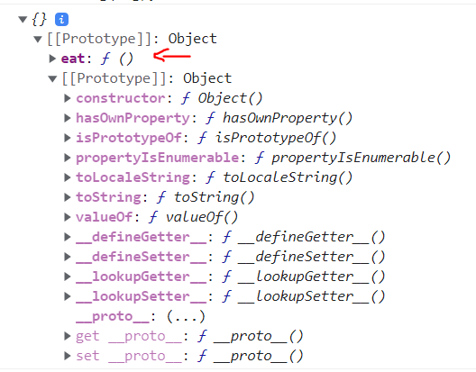

# jhon-quinteros

# YOU DON'T KNOW JS YET

## Chapter 1: What is JavaScript?

The language was conceived by Brendan Eich at Nescape, the name JavaScript was decided mainly by marketing. The language was standardized by TC39 as the ECMAScript.

### Language Specification

The TC39 committee gathers to add or change features of the language.
The process of transform a propose to a new feature is made in five stages (input the propose, describe it and show potential challenges, describe the syntax, refinement and feedback, inclusion in the ECMAScript).

### The Language Implementation

All the environments that implement JavaScript (browsers, servers) should follow the ECMAScript and in most cases it happens, but sometimes could happen that the engines that implements the ECMAScript doesn’t match with was defined. Also the engines add some features that are not defined in the specification i.e: the Console.log(), alert(), the REPL, etc…

### Multi-Paradigm

A paradigm is the approach of structuring the code, Javascript is multi-paradigm, it lets you code in a procedural, Object Oriented or Functional way.

### Backward & Forward Combability

Once a feature is accepted as standard it won’t be changed or removed, that way no matters how old is the code it will work. It also implies that every feature added should be carefully reviewed as it would be permanently. There are exceptions, but any change is evaluated to measure the impact of that change.

The forward compatibility means that new features added won’t break the code, Javascript is not forwards-compatible, because if code ignores the new features and it still runs it could fail or give undesirable results.

### Fixing compatibility Issues

As Javascript is not forwards compatible, you can use tool that will transpile the code to an older version of the standard that way the developer can still use the new feature without to worry about the compatibility.

Another technique is the use of pollyfills, it is code that is added to fill the gaps of the standard API, there are tools that already look for the missing features and add it, that way the code will still work.

### Javascript is Interpreted or Compiled

A language is considered interpreted when it runs from top to down line by line, one of the main drawbacks of it is the detections of errors, that are discovered at runtime when it execute the code line with the error.
A compiled language is when the code is parsed, optimized and it does a check the code, helping to find error before it runs.

Javascript is a parsed language, it means that before the code is executed it generates code (binary) checking possible errors. Once the binary code is generated, it is handled by the JS virtual machine. 
We can consider Javascript as a compiled language because it does several steps before it is executed, starting by the transpilation and addition of polyfills by babel and other tools, then the JS engine parse the code to AST(Abstract Syntax Tree), after that it is converted in a binary code (IR) and finally the JS VM execute the code.

### Web Assembly

It is a tool that let convert code thar is not in Javascript and run it over the JS VM. It does the compilation of the code ahead of time (AOT) so it can run in the JS VM, the main idea was to do performance improvement and bring no JS developers to the web, but there are new opportunities with this tool trying make it cross-platform.

### Strict mode

Javascript added the Strict mode `“use strict”;` in the ES5 version, this adds new  set of rules to the code you write below it, i.e: the value of `this` in the strict mode is `undefined`. Most of the projects by default uses strict mode either by the transpilers that add it or if you use the ES6 modules that also add it.


## Chapter 2: Surveying JS

### Each File is a Program

In Javascript each file is considered a program and they can interact among them by the global context. In the ES6 was added the module, there you can export the state and methods or import other ones.

### Values

Javascript has two categories of values, the primitives (numbers, string, Boolean, null, undefined and symbol) and objects.
An object is and unordered keyed collection of values, but Javascript also has arrays that are numerically ordered list of data. 

### Declaring Variable

A value can be literal (declared inline in the code) or held in a variable. You can use three keywords to declare a variable: the `var` it lets you declare and reassign its value it use a function scope, `let` is almost the same as `var` but it has a block scope, `const` it is block scope and it doesn’t let you reassign its value.

### Function

It is a group of statement that can be called several times, there are two was to define a function:

-	Declaring a function: the name is associated to the function at compilation time.

```
function test() {
}
```

-	Function expression: the function is assigned to the variable at runtime.

```
Var test = function() {
}
```

>  Note: in Javascript a function is a first class citizenship, it means that can be threated  as other types in Javascript, you can assign it to a variable or pass it as a parameter in other function.

### Comparisons

It lets you take decisions in the code based on the comparing values, in JS there are many ways to do it.

-	Strict Comparison: the operator for this is the `===` which compares the values and doesn’t let do coercion but there are two exception that fail with this operator, the `NaN ` and the `-0` for the `NaN ` you can use Number.isNaN() and for `-0` you can use Object.is().
In case of the objects, it does a comparison of the reference no by the content of the object(structure equality).

-	Coercive Comparisons: the operator == does comparison of value and type, but in case the types are different, it first does a coercion and then it does the comparison

### Classes

> ”Classes are a definition of a type of custom data structure that includes data and behaviors”
and to have concrete values of a class you need to insatiate it, i.e.

```
Class Page {
  Constructor(text) {
    this.text = text;
  }
  print() {
    console.log(this.text);
  }
}

var newPage = new Page(“test sample”);
newPage.print();
```

### Class Inheritance

It lets you share common behavior among classes i.e.

```
Class Publication {
  Constructor(title, author) {
    this.title = title;
    this.author = author;
  }
  print() {
    console.log(`
      Title: ${this.title}
      By: ${}
    `)
  }
}

Class Book extends Publication {
	constructor(title, author, ISBN) {
		super(title, author);
		this.ISBN = this.ISBN;
	}
	print() {
		super.print();
		console.log(`ISBN: ${ISBN}`);
  }
}
```

The `super` keyword is used to access the parent constructor and also to call it’s methods. The option of overriding the parent’s methods is called polymorphism.

### Modules

Modules are other way to organize the code, it helps you to group the code and import other modules to interact with.
Javascript defined the standard in the ES6 but there are also other implementation of modules: 
-	Asynchronous Module Definition(AMD)
-	Universal Modules Definition(UMD)
-	CommonJS

#### ES Module

It is the standard definition and these modules are always file based, one file one module. You need to use the keyword `export` in your module with the code that you want make available and `import` to get it. Note that those modules are singleton it is only instantiate the first time it is called.

Example:

```
export function printDetails(title, author) {
	console.log(`
		Title: ${title}
    By: ${author}
  `);
}
```
Then you can import this function in another module:

```
Import { printDetails } from “./file.js”;

printDetails(“title print”, ”Me”);
```

### Iteration

When you have big amounts of data instead of handle it at once you would prefer iterate with small chunks of the data until you process the whole, that is why Javascript standardized the protocol for iterator where you need to define the next() method.
JavaScript also give methods for consuming iterators one of the is the `for of ` another way is using the spread operator`(…)` both options help you to get the information from an iterator.

### Iterables

> Iterable is a value that can be iterated over. ES6 defined some structures as iterable: arrays, strings, maps, sets, etc. that are consumed by iterators.

## Chapter 3: Digging to the Roots of JS

### Closure

> Closure is when a function remembers and continues to access variables from outside its scope, even when the function is executed in a different scope.
Example:

```
function greeting(msg) {
	Return function who(name) {
		Console.log(`${msg}, ${who}`);
  }
}

var hello = greeting(“hello”);
var howdy = greeting(“howdy”);

hello(“Kyle”);
howdy(”Grant”);
```
In the above example we can see how the `greeting` function return another inner function `who`, but `who` can still access to the parameter sent to `greeting`.
What happens under hood is that the `msg` parameter is not deleted from the memory, it lets to have still access from the inner function even you can update that value.

### this Keyword

The keyword `this` is not static and is not based on the function definition, it can be changed based on how the function is called. It is defined by the “execution context”(we could this as an object whose properties are available to the function).

Example:

```
function study() {
	console.log(`Studying ${this.subject}`);
}

let math = {
  subject: “Math”,
  study: study
}

let biology = {
  subject: “Biology”,
  study: study
}

math.study();
biology.study();
```

### Prototypes

It helps to solve property access in objects, letting an object A access to methods of an object B creating a prototype chain. In Javascript the inheritance is made by prototypes.

### Object Linkage

You can assign the prototype of an object with the method `Object.create()`, this method create a new object with it’s prototype linked to the parameter sent.

```
let animal = {
    eat: function(){
        console.log("eating");
    }
}
let dog = Object.create(animal);
```



### this and Prototype-delegation

Prototype delegation is the way Javascript look for a method that was invoked by an object, if the object doesn’t have the method, it will look in the prototype chain until it finds it.
And it is related with the dynamic `this`, because it let you have the right `this` used when the method is called.

Exmple:

```
var car = {
	brand: “car”,
	turnOn() {
    console.log(`Turning on the ${this.brand}`);
  }
}
var mercedes = Object.create(car);
mercedes.brand = “Mercedes”
mercedes.turnOn();
// Turning on the Mercedes
```

## Chapter 4: The Bigger Picture

### Pillar 1: Scope and Closure

Scoped defines the accessibility of variables, all the variables defined in the current and outer scopes are available, but the variables defined in inner scopes aren’t. Javascript has some tricks on it, first “hoisting” when all the variables declared anywhere are treated as if they were declared at the beginning of the scope, the second is `var` that are only function scoped.

### Pillar 2: Prototypes

The prototype has been used mainly in inheritance, but it isn’t a rule you can connect two objects to cooperate dynamically. This is called “behavior delegation”.

### Pillar 3: Types and Coercion

In Javascript to avoid confusion  in type we use tools like typescript to work around it.

## Appendix

### Function forms

#### Anonymous function

Anonymous function are function that doesn’t have a name identifier between `function` and the parameter list `(…)`. Here Javascript does a “name inference”.

Example:

```
var sayHi = function() {
	console.log("Hello World");
}
console.log(sayHi.name);
//sayHi
```

The `name` property of the function return the name defined or inferred of the function.

Note: it won’t work if the anonymous function is sent as an argument to another function, the `name` property will return an empty string.


# You don’t know JS yet SCOPE & ClOSURES

## Chapter 1: What’s the Scope?

The scope is a set of rules that is applied in the code to define where are placed the variables, function and blocks.
A function can be assigned or passed around as a variable, but the variables that are access and hold doesn’t change, doesn’t matter where the function is executed. This feature is called closure.

### Compiled vs Interpreted

-	The compiled code follows a set of steps that convert the code into binary that computer can read. This process is only done once.
-	The interpreted code goes line by line converting the code line into the binary and is processed.

### Compiling Code

The definition of the scope is done in the step of “compilation”, that is why is important to understand it.
The compilation is composed of three stage:

-	Tokenizing/Lexing: This consist in split eh code into chunks called tokens, and Lexing is about determine if a token is distinct or part of another one.
-	Parsing: take an array of tokens and convert it into a tree of nested elements called Abstract Syntax Tree (AST).
-	Code Generation: it converts the AST into executable code.

The JS engine does this process JIT.

### The JS engine

There are two steps that the JS engine does, the parsing and compilation. You can see three characteristics to prove this:

-	Syntax errors: in the following snippet, the code doesn’t run instead it throws an error, showing how the code is not executed line by line.

```
Var greeting = “hello”;
console.log(greeting);
greeting = .”Hi”;
//SyntaxError
```

-	Early Errors: in the next snippet, you can see how an early error is thrown because in strict mode is not allowed have duplicated parameters, and the code doesn’t run.

```
saySomething(“Hello”, “Hi”);
//Syntax error

function saySomething(greeting, greeting) {
  "use strict";
  console.log(greeting);
}
```

-	Hoisting: in the example below you can see how the function fails because the `greeting` variable is being redeclared in the following line and it throws an error, and it only can happens if the scopes where already defined.

```
function saySomething() {
  var greeting = “Hello”;
  {
    Greeting = “Howdy”;
    let greeting = “Hi”;
    console.log(greeting);
  }
}
saySomething();
//ReferenceError
```

### Declaration of Variables

The declaration of variables can be used for target of assignment or source of a value.
The variable is a target if it is not being assigned in the statement, otherwise it is a source.

### Targets

There are different way that you can make a variable a target.
-	Assignment of a value `var a = “Hello”`
-	Assignment in loops `for (let student of students) `
-	Passing parameters in functions `getStudentName(50)`
-	Function declaration `function getStudentName(studenID) {}`, here an identifier `getStudentName` is declared(function hoisting)

### Sources

There are several ways to declare sources variables
-	In loops `for (let student of students)`, here the `students` variables is a source.
-	In conditionals `if (student.id == studenID)` in this case both variables are sources.
-	In calling functions `getStudentName(20)`.

### Scope and Runtime modifications

When the option `”use strict”;` is no used there are two keyword that can be used to modify the scope at runtime, but you shouldn’t.
-	`eval` this method lets you pass code in format of string and if it has function o variable declaration them are going to be added at runtime adding new scopes or adding new variables in the current scope.

```
function sayHello() {
	eval(“var hello = ‘hello’;”);
  console.log(hello);
}
sayHello();
//hello
```

-	The `with` this keyword lets you assign an object as if it were the scope of the block.

```
var pet = {age: 5, weight: 10}
with (pet) {
  console.log(`my pet has ${age} years and weight ${weight}`);
}
```

### Lexical Scope

Lexical Scope is defined at compilation time, and it is associated with the stage of lexing(compilation). The lexical scope is controlled by the placement of functions, block and variable declarations.
When you declare a variable inside a function the compiler associates the variable to the function scope, (let and const can also be associated to block scope).
When a variable is used in the scope, the compile will search for the declaration, if it is not in the current scope, it will look in the outer scopes until it finds it or reach the global scope, and if it isn’t founded it will throw an error.

## Chapter 2: Illustrating Lexical Scope

The variables are associated to the scope where they are declared, and these scopes are determined in compilation time. The scopes can be nested but it is the whole, there can’t be partial nested. A reference to a variable can be done if it is declared in the current or outer scope.

### Process of the code

To process the code there are three actors involved:
-	Engine: it compiles and execute the code.
-	Compiler: parse and generate the code.
-	Scope Manager: collect and maintain the variables identifier and the accessibility of them.
When a variable is declared and initialized the compiler will generate the tokens (lexing stage) and then parse into the AST, then will ask to the scope manager to create the new variable.
In the execution stage of the program, the engine work with the scope manager to assign the values to the variables declared and instantiate the functions scopes.

### Nested Scope

Every function or block creates its own scope and Scope manager, you can nest them as you want. The Scope Manager has a registry of the variable identifiers, when the identifier is from a function it initializes the function too, if it is a `var` identifier it is initialized as undefined, in the case of `let/const` are uninitialized.

### Lookup Failures

When the scope manager can’t found an identifier in its or outer scopes, an error is thrown. The error will change based on if the code is `strict mode` and if the variable was a target or source.
If the variable is source, a `ReferenceError` is thrown as the identifier is considered undeclared
If the variable is `target` and the code uses `strict mode` a `ReferenceError` is thrown.

### Undefined

There is a muddle between the terms `undefined` and the error `Not declared ReferenceError`, the first means that the variable exists but it doesn’t have a value, and the second means that the variable wasn’t declared.

### Global Variable

If you don’t use the `strict mode` and assign a value to a non-declared variable, the Scope Manager will create and global variable.

```
function getStudentName() {
  studentName = “Pepe”;
}

getStudentName();
console.log(studentName);
//Pepe
```

## Chapter 3: The Scope Chain

The connections between nested scopes is called “scope chain”, this determine the accessibility of a variable, this chain moves upward only.
The lookout for the variable is made at compilation time, so it improves the performance at runtime, but there is an exception and is when it can’t find the variable in the file it will look for the global scope in other files at runtime.

### Shadowing

You can’t repeat a name of a variable in a scope, but you can have the same variable name in nested scopes.

```
var name = “Pepe”;
function printName(name) {
  name = name.toUpperCase();
	console.log(name);
}

printName(name);
console.log(name);
//PEPE
//Pepe
```
When the variable is lookup and is found in the context it doesn’t take in account of the outer variables with the name, as shown in the example above. This feature is called “shadowing”. Something to be aware is that this shadowing affects to all the inner scopes, that now won’t be able to access the outer definition of the variable.

### Illegal Shadowing

Trying to shadow a `let` with a `var` is invalid if the var is inside a block, it only will work if the var is inside of an inner function,

```
//Valid case:
function shadowing() {
  let special = "Javascript";
	function test() {
		var special = "Java";
	}
}

//Invalid case:
function shadowing() {
  let special = "Javascript";
	{
		var special = "Java";
	}
}
```

### function declaration vs function expression

There are couple of differences between using function declaration or expression.
The function declaration is hoisted, but the expression not, only the name of the var is hoisted.

```
// function declaration
function helloWorld() {}

// anonymous function expression
var helloWorld = function(){}
```

### Arrow functions

Arrow function is a new way of function expression and it is anonymous, it has the same rules for lexical scope, the variable declaration has the same behavior.
